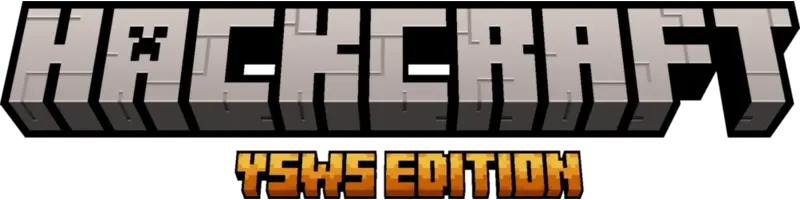

</a>

  Build a Minecraft mod • Get games!

Check it out at https://hackcraft.hackclub.com

---

Made in react with nextjs and love 💖

## Important files
- [src/app](https://github.com/hackclub/hackcraft/tree/main/src/app): This is the folder for next's app router, the folders here match up with the paths you can access on the website.
- [src/app/projects](https://github.com/hackclub/hackcraft/tree/main/src/app/projects): The project management platform
- [src/app/gallery](https://github.com/hackclub/hackcraft/tree/main/src/app/gallery): The gallery page showing off all submissions!
- [src/app/guide](https://github.com/hackclub/hackcraft/tree/main/src/app/guide): The guide™
- [src/components](https://github.com/hackclub/hackcraft/tree/main/src/components): Common components used throughout the codebase.
- [src/lib/api.ts](https://github.com/hackclub/hackcraft/blob/main/src/lib/api.ts): This is our Data Access Layer. It controls what airtable data the rest of the codebase can access.

## Developement
To run this locally run `bun dev`. If you wanna send over a patch kindly run `bun format` before sending it over!

_Fun fact: this was actually [forked](https://en.wikipedia.org/wiki/Ship_of_Theseus) from boba.hackclub.com_
